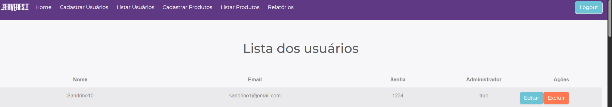

# Ambev Technical Assessment Test

This project contains automated tests for the ServeRest application, including both frontend (E2E) tests using Cypress and API tests using Postman. The tests are designed to validate the functionality of the ServeRest platform at https://front.serverest.dev.

## 📋 Project Structure

```
├── cypress/                          # Cypress E2E test framework
│   ├── e2e/                         # End-to-end test files
│   │   ├── Cadastro.cy.js          # User registration tests
│   │   └── FrontEnd.cy.js          # Frontend functionality tests
│   ├── fixtures/                    # Test data files
│   ├── screenshots/                 # Test execution screenshots
│   └── support/                     # Support files and custom commands
│       ├── commands.js             # Custom Cypress commands
│       └── e2e.js                  # E2E configuration
├── PostmanAPI/                      # API testing with Postman
│   └── API - serverest.dev.postman_collection.json
├── cypress.config.js                # Cypress configuration
├── package.json                     # Project dependencies
└── README.md                        # This file
```

## 🛠️ Technologies Used

- **Cypress**: End-to-end testing framework for web applications
- **Postman**: API testing and documentation
- **JavaScript**: Programming language for test scripts
- **Node.js**: Runtime environment

## 📦 Dependencies

### Dev Dependencies
- `cypress`: ^15.6.0 - E2E testing framework
- `cypress-file-upload`: ^5.0.8 - File upload support for Cypress

## 🚀 Getting Started

### Prerequisites

- Node.js (version 14 or higher)
- npm or yarn package manager

### Installation

1. Clone the repository:
```bash
git clone https://github.com/LRCCN/Ambev_Technical-assessment-test.git
cd Technical-assessment-test
```

2. Install dependencies:
```bash
npm install
```

## 🧪 Running Tests

### Cypress E2E Tests

#### Interactive Mode (Cypress Test Runner)
```bash
npx cypress open
```

#### Headless Mode (Command Line)
```bash
npx cypress run
```

#### Run Specific Test File
```bash
npx cypress run --spec "cypress/e2e/FrontEnd.cy.js"
npx cypress run --spec "cypress/e2e/Cadastro.cy.js"
```

### API Tests (Postman)

1. Import the collection file `PostmanAPI/API - serverest.dev.postman_collection.json` into Postman
2. Run the collection manually or use Newman for command-line execution:

```bash
npm install -g newman
newman run "PostmanAPI/API - serverest.dev.postman_collection.json"
```

## 📝 Test Cases

### Frontend Tests (FrontEnd.cy.js)
- **Page Visibility**: Validates that the login page loads correctly
- **Login Validation**: Tests login functionality with various scenarios:
  - Empty credentials
  - Invalid credentials
  - Valid login flow

### Registration Tests (Cadastro.cy.js)
- **User Registration**: Tests user registration functionality
- **Administrator Registration**: Validates admin user creation
- **Validation Scenarios**: Tests form validation and error handling

## ⚙️ Configuration

### Cypress Configuration (`cypress.config.js`)
- **Base URL**: https://front.serverest.dev
- **Viewport**: 1280x720
- **E2E Setup**: Configured for end-to-end testing

### Test Data
- Test data and fixtures are stored in the `cypress/fixtures/` directory
- Screenshots of test runs are automatically saved in `cypress/screenshots/`

## 🔧 Custom Commands

Custom Cypress commands are defined in `cypress/support/commands.js` to extend Cypress functionality and create reusable test actions.

## 📊 Test Reports

Cypress generates detailed test reports including:
- Test execution videos (in headless mode)
- Screenshots on test failures
- Detailed logs and assertions

## 🤝 Contributing

1. Fork the repository
2. Create a feature branch: `git checkout -b feature/your-feature-name`
3. Commit your changes: `git commit -m 'Add some feature'`
4. Push to the branch: `git push origin feature/your-feature-name`
5. Open a pull request

## 📄 License

This project is part of a technical assessment for Ambev.

## 🐛 Issues and Support

Issue 1: Critério de Inputs incorretos ao clicar mais de 1 vez no botão "Entrar".
Reprodução: Acessar a página: https://front.serverest.dev/login > Fazer Login > Inserir email > "Entrar"


Issue 2: Botão Editar não funciona.
Reprodução: Acessar a página > Fazer Login > Lista de Usuários > "Editar"


---

**Note**: This project is designed for testing the ServeRest application and demonstrates automated testing capabilities using modern testing frameworks.